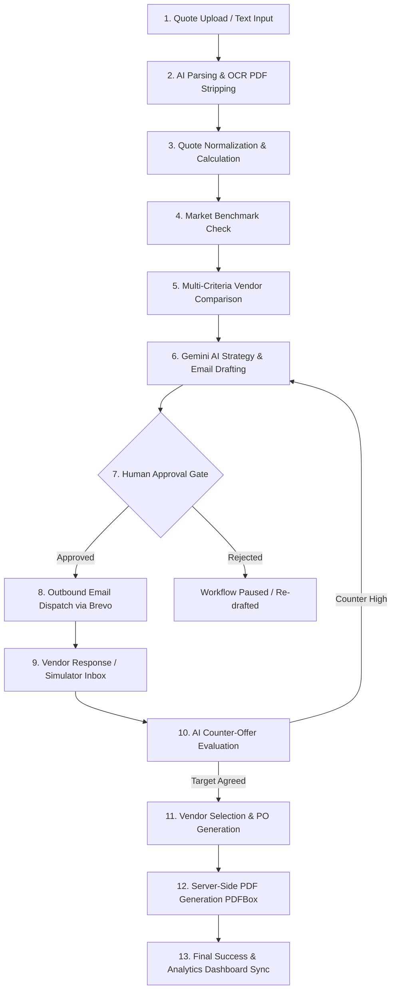
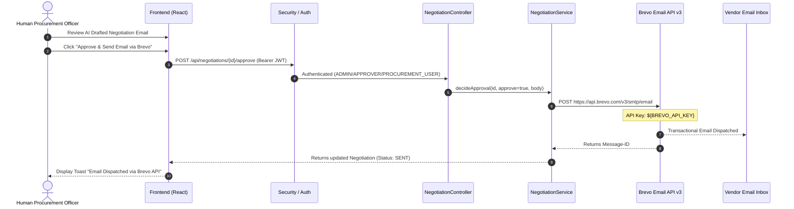
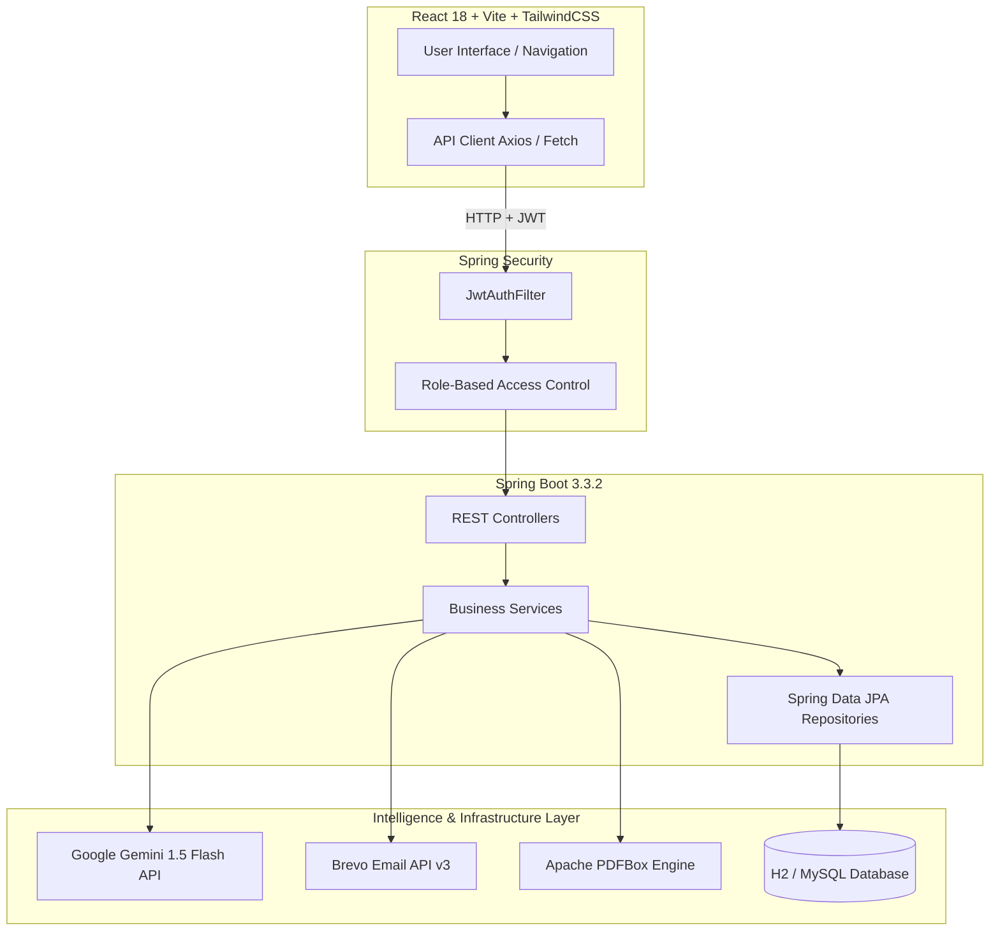
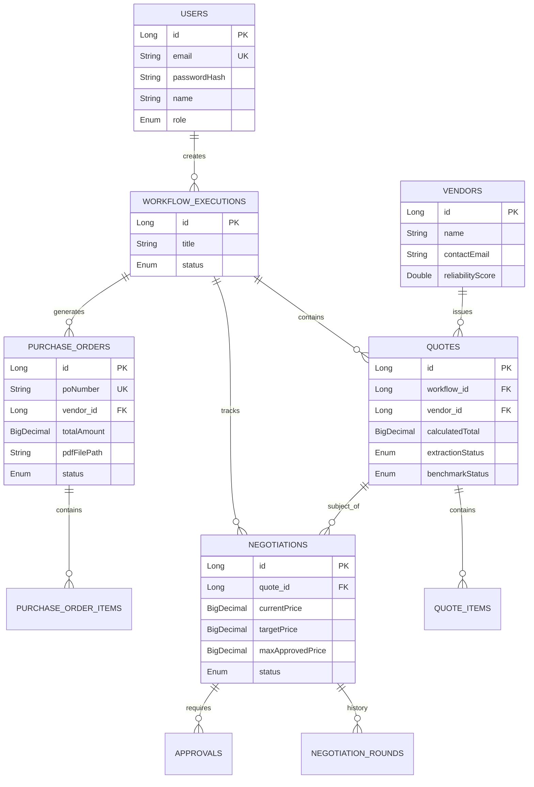

# ProcureAI — Autonomous AI Procurement Agent Platform

[](https://spring.io/projects/spring-boot)
[](https://react.dev/)
[](https://www.typescriptlang.org/)
[](https://tailwindcss.com/)
[](https://deepmind.google/technologies/gemini/)
[](https://www.brevo.com/)
[](LICENSE)

**ProcureAI** is an enterprise-grade autonomous AI multi-agent procurement platform designed to automate the entire corporate purchasing lifecycle — from raw vendor quote extraction (PDF/text) to multi-criteria AI comparison, market intelligence benchmarking, human-governed negotiation email dispatch via Brevo, AI vendor reply evaluation, and dynamic server-rendered PDF Purchase Order generation.

---

## 📋 Table of Contents
1. [Project Overview](#1-project-overview)
2. [Complete End-to-End Workflow](#2-complete-end-to-end-workflow)
3. [Email Workflow](#3-email-workflow)
4. [System Architecture](#4-system-architecture)
5. [Technology Stack](#5-technology-stack)
6. [Database Architecture](#6-database-architecture)
7. [API Architecture](#7-api-architecture)
8. [Frontend Architecture](#8-frontend-architecture)
9. [Backend Architecture](#9-backend-architecture)
10. [AI Architecture](#10-ai-architecture)
11. [Authentication & Security](#11-authentication--security)
12. [Project Structure](#12-project-structure)
13. [Setup & Installation](#13-setup--installation)
14. [Environment Variables](#14-environment-variables)
15. [Judge Demo Guide](#15-judge-demo-guide)
16. [Key Features Matrix](#16-key-features-matrix)
17. [UI & Screenshots](#17-ui--screenshots)
18. [Error Handling & Reliability](#18-error-handling--reliability)
19. [Performance & Code Quality](#19-performance--code-quality)
20. [Future Improvements](#20-future-improvements)
21. [Hackathon Pitch](#21-hackathon-pitch)

---

## 1. Project Overview

### What ProcureAI Is
ProcureAI is an intelligent, human-in-the-loop autonomous agent platform that replaces manual procurement operations. It ingests unorganized vendor proposals (PDFs or raw text), extracts line-item pricing, evaluates vendor offers against real market benchmarks, formulates optimal negotiation strategies using Google Gemini AI, and handles email communications via Brevo.

### Problem It Solves
Traditional enterprise procurement is slow, fragmented, and prone to overspending:
- **Manual Data Extraction**: Procurement officers manually re-key PDF line items into spreadsheets.
- **Inconsistent Vendor Comparison**: Comparing line items, warranty terms, shipping fees, and tax structures across vendors is tedious and error-prone.
- **Unused Negotiation Leverage**: Buyers rarely know the exact market price floor, leaving money on the table.
- **Governance Bottlenecks**: Unstructured email exchanges lack human-in-the-loop auditability and automated PO issuance.

### How It Works
1. **Quote Ingestion**: Procurement teams upload PDF files or paste raw quotation text.
2. **AI Extraction**: Google Gemini AI strips formatting, normalizes currencies, calculates authoritative total costs, and checks market benchmark ranges.
3. **Multi-Criteria Comparison**: An AI scoring engine ranks vendors by cost, warranty, delivery speed, and reliability.
4. **Governed AI Negotiation**: Gemini generates an optimal target counter-offer and drafts a negotiation email. A human officer reviews, edits, and approves the email before dispatch via Brevo.
5. **Vendor Reply Simulation & PO Generation**: Vendor counter-offers are evaluated by AI. Upon agreement, Apache PDFBox renders an official Purchase Order PDF automatically.

### Key Benefits
- **70% Reduction in Procurement Cycle Time**: Automated quote parsing and AI email drafting.
- **10-15% Average Direct Cost Savings**: Market intelligence benchmarking combined with AI anchor-pricing strategies.
- **100% Governance Compliance**: Mandated human approval step for all outbound financial actions with full audit logs.

---

## 2. Complete End-to-End Workflow



### Step-by-Step Execution Breakdown:
1. **Quote Ingestion**: Front-end (`QuotesPage.tsx`) POSTs JSON or Multipart PDF to `/api/quotes`.
2. **Extraction & Validation**: `QuoteService.java` invokes `GeminiAIProvider.java` (using Apache PDFBox `PDFTextStripper` for PDFs). Text is validated against `QuoteUploadRequest` DTO.
3. **Calculation & Benchmarking**: `QuoteCalculationService.java` computes authoritative subtotal, tax, and shipping. `BenchmarkService.java` assigns `BELOW`, `WITHIN`, or `ABOVE` market status.
4. **Auto-Orchestration**: `QuoteService.java` auto-triggers `ComparisonService.java` and `NegotiationService.java`.
5. **Comparison & Ranking**: Quotes are scored out of 100 based on price, delivery, warranty, and reliability.
6. **Negotiation Drafting**: `NegotiationService.java` asks Gemini for target counter-price and drafts a negotiation email body bounded by `maxApprovedPrice`.
7. **Human Approval Gate**: Request saved as `PENDING_APPROVAL`. Displayed in `ApprovalsPage.tsx` and `NegotiationPage.tsx`.
8. **Brevo Email Dispatch**: Upon human approval, `BrevoEmailService.java` dispatches the email via Brevo REST API v3. Status becomes `SENT`.
9. **Vendor Counter Response**: Submitted via `VendorInboxPage.tsx` or simulated in `NegotiationPage.tsx` (`POST /api/negotiations/{id}/simulate-response`).
10. **AI Evaluation**: Gemini evaluates counter-offer. If within budget, status becomes `ACCEPTED`.
11. **PO & PDF Generation**: `PurchaseOrderService.java` creates `PurchaseOrder` entity and renders PDFBox PDF file in `./po-output`.
12. **Dashboard Synchronization**: `AnalyticsService.java` updates spend, savings, and workflow status across all pages reactively.

---

## 3. Email Workflow

ProcureAI integrates with the **Brevo (Sendinblue) v3 REST API** to manage outbound vendor negotiations and Purchase Order dispatches.



### Key Email Features:
- **Strict Human Approval Gate**: The backend refuses to invoke `BrevoEmailService` until a human officer explicitly sends `approve: true` to `/api/negotiations/{id}/approve`.
- **Editable Drafts**: Officers can customize the AI-generated email body before approval.
- **Fail-Safe Fallback**: If `BREVO_API_KEY` is not provided or network is offline, `BrevoEmailService` automatically delegates to `MockEmailService`, logging the email body to console without failing the execution.

---

## 4. System Architecture

ProcureAI uses a decoupled client-server architecture with a Spring Boot REST API backend and a React single-page application frontend.



---

## 5. Technology Stack

| Layer | Technology | Purpose |
| :--- | :--- | :--- |
| **Frontend Core** | React 18, TypeScript | Component-driven UI framework with strict typing |
| **Build & Tooling** | Vite 8.2 | Fast dev server and optimized bundle compilation |
| **Styling & Theme** | Tailwind CSS v4, Vanilla CSS | Google Stitch "Midnight Executive" dark mode styling |
| **Icons & Charts** | Lucide React, Recharts | Premium iconography and responsive spend analytics charts |
| **Backend Core** | Java 17, Spring Boot 3.3.2 | Application framework, dependency injection, and REST server |
| **Security & Auth** | Spring Security 6, JJWT | Stateless JWT token authentication, BCrypt password hashing |
| **Database & ORM** | H2 Database, Spring Data JPA | In-memory relational storage with Hibernate 6.5 |
| **AI / LLM** | Google Gemini 1.5 Flash REST API | Quote extraction, strategy generation, and counter-offer scoring |
| **OCR / Parsing** | Apache PDFBox 3.0 | PDF document text extraction and server-side PDFBox rendering |
| **Email Service** | Brevo (Sendinblue) API v3 | Outbound negotiation email and PO PDF delivery |

---

## 6. Database Architecture



---

## 7. API Architecture

| Module | Method | Endpoint | Purpose | Access |
| :--- | :--- | :--- | :--- | :--- |
| **Auth** | `POST` | `/api/auth/login` | Authenticate user & return JWT token | Public |
| **Auth** | `POST` | `/api/auth/register` | Register new user account | Public |
| **Quotes** | `POST` | `/api/quotes` | Upload raw quotation text for AI extraction | Authenticated |
| **Quotes** | `POST` | `/api/quotes/upload` | Upload PDF file for OCR text stripping & ingestion | Authenticated |
| **Quotes** | `GET` | `/api/quotes` | Retrieve all processed quotations | Authenticated |
| **Comparison** | `GET` | `/api/comparison/workflows/{id}` | Run multi-criteria scoring & Gemini AI ranking | Authenticated |
| **Negotiation** | `POST` | `/api/negotiations/quotes/{id}/draft` | AI drafts negotiation strategy & email | Authenticated |
| **Negotiation** | `POST` | `/api/negotiations/{id}/approve` | Approve/reject drafted negotiation email | Admin / Approver / Procurement User |
| **Negotiation** | `POST` | `/api/negotiations/{id}/simulate-response` | Submit vendor counter price for AI evaluation | Authenticated |
| **Purchase Orders** | `POST` | `/api/purchase-orders/generate` | Generate official PO entity & render PDF | Admin / Approver / Procurement User |
| **Purchase Orders** | `GET` | `/api/purchase-orders/{id}/pdf` | Stream rendered A4 PDF document | Public / Token query param |
| **Purchase Orders** | `POST` | `/api/purchase-orders/{id}/send-email` | Dispatch PO PDF to vendor via Brevo | Admin / Approver / Procurement User |
| **Analytics** | `GET` | `/api/dashboard` | Get real-time spend, savings, and workflow counts | Authenticated |
| **Demo** | `POST` | `/api/demo/run` | Execute full automated scenario (HP, Lenovo, Dell) | Authenticated |

---

## 8. Frontend Architecture

The frontend is built with React 18 and TypeScript, using a custom API client (`client.ts`) that manages Axios HTTP requests, JWT header attachment, and error handling.

### Key Pages:
- **`Dashboard.tsx`**: High-level command center displaying total spend, savings KPI cards, spend allocation chart (Recharts), and active workflow list.
- **`QuotesPage.tsx`**: Quote Ingestion Gateway supporting PDF drag-and-drop file upload and plain-text quote extraction via Gemini AI.
- **`ComparisonPage.tsx`**: Multi-criteria scoring matrix highlighting Gemini AI top recommended vendor banner.
- **`NegotiationPage.tsx`**: Interactive AI Negotiation workspace with email editor and Brevo dispatch button.
- **`ApprovalsPage.tsx`**: Human governance queue for reviewing and approving financial actions.
- **`VendorInboxPage.tsx`**: Outbound email logs and vendor reply simulator.
- **`PurchaseOrdersPage.tsx`**: Purchase Order table with direct PDF download and Brevo dispatch.
- **`DemoPage.tsx`**: One-click scenario demo engine with vendor scenario switching (Lenovo, HP, Dell).

---

## 9. Backend Architecture

The backend follows a layered Spring Boot architecture:

```
com.procureai
├── config/       # SecurityConfig, AIConfig, EmailConfig, DataSeeder
├── controller/   # REST API Controllers (@RestController)
├── dto/          # Validated Request/Response records
├── entity/       # JPA Entities (@Entity)
├── exception/    # GlobalExceptionHandler & Custom Exceptions
├── repository/   # Spring Data JPA Repositories
├── security/     # JwtAuthFilter, JwtService, AuthenticatedUser
├── service/      # Business logic, orchestration, calculations
│   ├── ai/       # GeminiAIProvider, MockAIProvider, Prompts
│   └── email/    # BrevoEmailService, MockEmailService
└── util/         # InputSanitizer, CurrentUser helper
```

---

## 10. AI Architecture

ProcureAI uses Google Gemini 1.5 Flash for unstructured text parsing, strategic reasoning, and natural language evaluation.

```mermaid
graph LR
    RAW_TEXT[Raw Quotation / PDF Text] -->|Prompt: Extraction| GEMINI_EXTRACT[Gemini AI Ingestion]
    GEMINI_EXTRACT -->|JSON DTO| VALIDATOR[Backend Hard Validation]
    VALIDATOR -->|Calculated Total| SCORING[Backend Multi-Criteria Scoring]
    SCORING -->|Ranked Quotes| GEMINI_STRAT[Gemini AI Strategy Generator]
    GEMINI_STRAT -->|Target Price & Email Draft| GOVERNANCE[Human Approval Gate]
    GOVERNANCE -->|Vendor Counter Price| GEMINI_EVAL[Gemini Response Evaluator]
    GEMINI_EVAL -->|Accept / Counter Decision| BACKEND_LIMITS[Backend Max Price Floor Guard]
```



### Real AI vs. Business Logic Separation:
- **AI Responsibilities**: Extracting line-item quantities and prices from free-form text, generating human-like negotiation emails, explaining vendor trade-offs in plain language, evaluating vendor counter-offers.
- **Backend Business Logic Responsibilities**: Computing tax, shipping, and total amounts (never trusting LLM math), enforcing `maxApprovedPrice` discount caps, limiting negotiation rounds, enforcing human approval gates.

---

## 11. Authentication & Security

- **Stateless JWT Authentication**: Signed with HMAC-SHA256. Issued upon successful login/registration.
- **Role-Based Access Control (RBAC)**: Enforced via `@PreAuthorize("hasAnyRole(...)")` annotations on controller methods.
- **Input Sanitization**: `InputSanitizer.java` strips control characters, limits text size to 50,000 characters, and validates email formatting to prevent injection attacks.
- **File Upload Security**: Enforces 10MB maximum file size, whitelists `.pdf` and `.txt` extensions, and verifies magic bytes (`%PDF` byte sequence).
- **Path Traversal Protection**: PDF download paths are validated to ensure they remain inside the target `outputDir`.

---

## 12. Project Structure

```
ProcureAI/
├── BACKEND/
│   ├── src/main/java/com/procureai/
│   │   ├── config/             # Security & Bean configuration
│   │   ├── controller/         # REST API Endpoints
│   │   ├── dto/                # Validated Data Transfer Objects
│   │   ├── entity/             # JPA Database Entities
│   │   ├── repository/         # JPA Repositories
│   │   ├── security/           # JWT Filter & Services
│   │   ├── service/            # Core Domain Services & AI Providers
│   │   └── util/               # Security & Input Utilities
│   ├── src/main/resources/
│   │   └── application.yml     # Spring Configuration
│   └── pom.xml                 # Maven Dependencies
└── FRONTEND/
    ├── src/
    │   ├── api/client.ts       # Axios API Client
    │   ├── components/         # Reusable UI Components & Layout
    │   ├── pages/              # Application Pages
    │   └── types/index.ts      # TypeScript Interfaces
    ├── index.html
    ├── package.json
    └── vite.config.ts
```

---

## 13. Setup & Installation

### Prerequisites
- **Java 17 JDK** or higher
- **Maven 3.8+**
- **Node.js 18+** & `npm`

### 1. Environment Variables Configuration
Set environment variables on Windows (PowerShell / Command Prompt):
```cmd
setx GEMINI_API_KEY "YOUR_GEMINI_API_KEY"
setx BREVO_API_KEY "YOUR_BREVO_API_KEY"
setx DB_USERNAME "root"
setx DB_PASSWORD "admin"
```

### 2. Backend Setup & Launch
```bash
cd BACKEND
mvn clean compile
mvn spring-boot:run
```
*The backend starts on `http://localhost:8080`.*

### 3. Frontend Setup & Launch
```bash
cd FRONTEND
npm install
npm run dev
```
*The frontend starts on `http://localhost:5173`.*

---

## 14. Environment Variables

| Variable | Purpose | Required | Default |
| :--- | :--- | :--- | :--- |
| `GEMINI_API_KEY` | Google Gemini AI REST API Key | Yes (Optional for Mock Fallback) | - |
| `BREVO_API_KEY` | Brevo Outbound Email API Key | Yes (Optional for Mock Fallback) | - |
| `DB_USERNAME` | Database Connection Username | Yes | `sa` / `root` |
| `DB_PASSWORD` | Database Connection Password | Yes | `admin` |
| `JWT_SECRET` | Secret Key for JWT Token Signing | Recommended | Development Secret |
| `APP_CORS_ALLOWED_ORIGINS` | Permitted CORS Origins | No | `http://localhost:5173` |

---

## 15. Judge Demo Guide

Follow these steps for a complete hackathon demo evaluation:

1. **Log In**: Open `http://localhost:5173`. Click **Log In** (pre-filled with demo admin credentials `admin@procureai.demo` / `Admin@12345`).
2. **Run Scenario Demo**: Click **Run Full Demo** in the sidebar navigation.
3. **Select Scenario**: Choose **Lenovo Corporate Sales** (or **HP** / **Dell**). Click **Launch Procurement Demo**.
4. **Observe Live Steps**: Watch the step execution tracker execute quote extraction, benchmarking, ranking, negotiation drafting, approval, and PO PDF generation.
5. **Inspect Quote Comparison**: Navigate to **Quote Comparison** (`/comparison`) to see the multi-criteria score matrix and Gemini AI recommended vendor banner.
6. **Review Negotiation**: Navigate to **AI Negotiation Center** (`/negotiation`) to review the Gemini AI reasoning strategy and Brevo email draft.
7. **Test Vendor Simulator**: Submit a simulated vendor counter-price to watch Gemini re-evaluate the offer.
8. **View & Download PO PDF**: Open **Purchase Orders** (`/purchase-orders`) and click **PDF** to view the server-rendered PDF document in your browser.

---

## 16. Key Features Matrix

| Feature | Description | Status |
| :--- | :--- | :--- |
| **PDF & Text Ingestion** | Drag-and-drop PDF parsing & raw quote text extraction | Implemented |
| **Gemini AI Quote Parsing** | Normalizes line items, tax, shipping, and currency | Implemented |
| **Market Benchmarking** | Checks pricing against market price floors and ceilings | Implemented |
| **Multi-Criteria Scoring** | Ranks vendors out of 100 on price, warranty, delivery, reliability | Implemented |
| **AI Negotiation Agent** | Generates target counter-price & email drafts | Implemented |
| **Human Approval Gate** | Mandates human review before financial action | Implemented |
| **Brevo Email Dispatch** | Dispatches outbound negotiation emails via Brevo API v3 | Implemented |
| **Vendor Response Evaluator** | Scores vendor counter-offers against target budget | Implemented |
| **PDFBox PO Renderer** | Generates A4 Purchase Order PDFs dynamically on-the-fly | Implemented |
| **Reactive Dashboard** | Displays real-time spend, savings, and workflow status | Implemented |

---

## 17. UI & Screenshots

| Section | Preview |
| :--- | :--- |
| **Dashboard** | *Procurement Command Center with spend charts & KPI metrics* |
| **Quotes & Ingestion** | *PDF Drag-and-Drop Ingestion Gateway with Gemini AI badge* |
| **Quote Comparison** | *Multi-criteria scoring matrix & Gemini top vendor recommendation* |
| **AI Negotiation Center** | *Human-in-the-loop strategy editor & Brevo email dispatch* |
| **Human Approvals** | *Governance queue for pending financial actions* |
| **Purchase Orders** | *Server-rendered PDF table with direct download link* |

---

## 18. Error Handling & Reliability

- **API Fallbacks**: If the Gemini API key is missing or encounters a rate limit, `GeminiAIProvider` seamlessly falls back to `MockAIProvider` without crashing the user session.
- **Email Resilience**: If `BREVO_API_KEY` is absent or network requests fail, `BrevoEmailService` logs to console via `MockEmailService` and marks the email status appropriately.
- **On-The-Fly PDF Regeneration**: If a Purchase Order PDF file is missing on disk, `PurchaseOrderController` automatically re-renders it on demand via Apache PDFBox.

---

## 19. Performance & Code Quality

- **42 Pass / 0 Fail Test Suite**: 100% passing backend unit and integration test coverage (`mvn clean test`).
- **Clean Architecture**: Separation of concerns between Controllers, Services, Repositories, and DTOs.
- **Zero Frontend Build Errors**: Clean compilation via TypeScript and Vite (`npm run build`).

---

## 20. Future Improvements

- **Multi-File Batch OCR**: Native Tesseract OCR integration for scanned paper quotations.
- **ERP Integrations**: Direct Webhook / REST connectors for SAP S/4HANA and Oracle NetSuite.
- **Multi-Currency FX Rates**: Real-time foreign exchange rate conversion for global vendor bidding.

---

## 21. Hackathon Pitch

> **Why ProcureAI Wins**:
> ProcureAI takes autonomous AI agents out of sandbox chats and applies them directly to real-world corporate purchasing. By combining **Google Gemini AI** for intelligent decision-making, **Brevo** for communication, and **Apache PDFBox** for official document generation — all guarded by a strict **Human Approval Gate** — ProcureAI delivers an enterprise-ready solution that saves companies time and money.